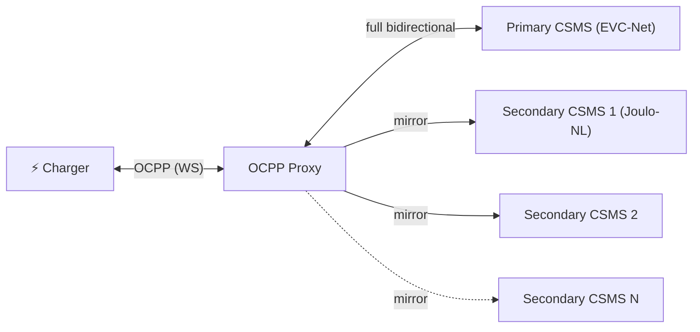

# jrverheij/joulo-ocpp-proxy

A highly reliable, lightweight, and production-ready **OCPP WebSocket proxy** sitting between EV chargers and multiple CSMS backends.

This fork builds upon the original `joulo-nl/joulo-ocpp-proxy` and introduces enterprise-grade diagnostics, security, and stability:

*   **Premium Diagnostics Dashboard (`/status`):** A beautiful glassmorphic real-time UI dashboard presenting active session statuses, live uptimes, message type breakdowns, and smooth animated graphs for power (kW) and energy (kWh).
*   **Version & SHA Hash Display:** Shows the deployed Git commit SHA directly on the dashboard header and via `/api/status` to easily track running software versions.
*   **Strict GDPR Data Privacy & Masking:** Dynamic masking of charge point IDs (e.g. `07*****72`), query parameters and auth tokens (e.g. `auth=z8*****Z2`), and full IP address anonymization (`80.61.x.x`) across all container logs and API endpoints.
*   **Visitor Hostname Masking:** An additional client-side protection layer on `/status` that obscures domain hostnames and strips out security query tokens (`wss://oc***p.jo***o.***/07*****72?auth=***`) to prevent unauthorized dashboard visitors from obtaining network metadata, while preserving complete server logs for debugging.
*   **Disk-Persistent Bounded Queue:** When a secondary CSMS is offline, critical messages (`StartTransaction`, `StopTransaction`, `MeterValues`) are serialized to a disk-based persistent queue to ensure zero telemetry loss. Non-critical messages (like `Heartbeat`) are held in a bounded in-memory buffer.
*   **Resilient Session State & Lifetime Energy Tracker:** Throttles writes to disk to save active charging metrics, rolling chart histories, and cumulative transaction energy (kWh) to survive proxy container restarts.
*   **Stale Session Cleanup (PR #3):** Automatically destroys any existing stale sessions when a charger reconnects, cleanly terminating the zombie WebSocket connection to EVC-net, preventing charger reconnect loops.
*   **Auto-Pong & Startup Buffer:** Buffers early op-code packets during handshakes to prevent packet drops and disables auto-pongs for transparent protocol state management.
*   **Automated Dependency Updates & Registry Cleanup:** Weekly security scanning via Dependabot, alongside automated GitHub Actions cleanup to prune old intermediate `sha-*` package versions from GHCR.

---

## Architecture & How It Works



| Direction | Primary CSMS | Secondary CSMS (×N) |
|---|---|---|
| Charger → CSMS | ✅ Forwarded | ✅ Mirrored (read-only copy) |
| CSMS → Charger | ✅ Forwarded | ❌ Ignored / Dropped |

The **primary CSMS** has full bidirectional control. Any number of **secondary backends** can be attached to receive read-only mirrored telemetry (such as meter values, start/stop transitions). Secondary failures and reconnect loops are completely isolated and never affect the primary charging loop.

---

## Advanced Features

### 1. Real-Time Diagnostics UI (`/status`)
Accessible directly at `/status` (e.g., `https://ocpp.cloud.citroentje.com/status`), sitting on a dark, glassmorphic layout:
*   **Rolling Telemetry Graphs:** High-fidelity animated Chart.js graphs mapping the last 100 MeterValues points for **Power Consumption (kW)** and **Energy Consumption (kWh)**.
*   **Timezone-Aware:** Millisecond timestamps are mapped on the client-side, displaying graph coordinates in the visitor's local browser timezone.
*   **Message Type Breakdown:** Real-time counter pills showing a live count of processed OCPP commands (e.g. `Heartbeat`, `MeterValues`, `StatusNotification`, `TriggerMessage`, `BootNotification`).

### 2. GDPR-Compliant Data Security
*   **Logs:** System logs are stripped of raw credentials and IDs (logs use masked values like `07*****72` and `auth=z8*****Z2`).
*   **IP Anonymization:** Client IP addresses are dynamically anonymized (last two segments replaced by `x.x` for IPv4) in both container output logs and the public `/api/status` API.
*   **Domain & Path Masking:** Public visitors accessing the dashboard `/status` will see fully obscured upstream URL targets (`wss://***.ev***t.***/07*****72`) to shield the network configuration.

### 3. Resiliency & Mirroring
*   **Auto-reconnect:** Proxy automatically attempts reconnecting to secondary CSMS backends every 10s.
*   **Disk-Persistent Queue:** If a secondary CSMS goes offline, critical transaction data (`StartTransaction`, `StopTransaction`, and `MeterValues`) is immediately persisted to disk. Re-established connections automatically flush the persistent queue chronologically before resuming live forwarding.
*   **Resilient Session State:** Retains session graphs, message type counters, and active session energy across restarts.
*   **Lifetime kWh Accumulator:** Accumulates and rounds total session energy to 3 decimal places (1 Wh precision), committing completed transaction totals to a persistent lifetime metric.
*   **WebSocket Keepalive:** Sends active WebSocket pings every 30s and forces reconnects if a pong is not received within 90s (mitigating silent TCP dead locks).

---

## Configuration

All configuration is managed via environment variables:

| Variable | Required | Default | Description |
|---|---|---|---|
| `PORT` | No | `9000` | Port the proxy server listens on |
| `PRIMARY_CSMS_URL` | **Yes** | — | WebSocket URL of your primary CSMS |
| `SECONDARY_CSMS_URLS` | No | — | Comma-separated list of secondary CSMS URLs |
| `LOG_LEVEL` | No | `info` | `debug`, `info`, `warn`, or `error` |
| `QUEUE_DIR` | No | — | Path to disk directory for persistent queues and state |

---

## Quick Start

### Using Docker (Recommended)
Images are built and published automatically to the GitHub Container Registry.

```bash
docker run -d \
  -p 9000:9000 \
  -v /var/lib/ocpp-proxy:/app/queue \
  -e PRIMARY_CSMS_URL=wss://your-primary-csms.example.com/ocpp \
  -e SECONDARY_CSMS_URLS=wss://analytics.example.com/ocpp \
  -e QUEUE_DIR=/app/queue \
  ghcr.io/jrverheij/joulo-ocpp-proxy:main
```

### From Source
```bash
git clone https://github.com/jrverheij/joulo-ocpp-proxy.git
cd joulo-ocpp-proxy
npm install
npm run build
PRIMARY_CSMS_URL=wss://your-csms.example.com/ocpp QUEUE_DIR=./queue npm start
```

---

## Charger Configuration

Point your charger's backend URL to the proxy endpoint:
```
Before:  wss://your-csms.example.com/ocpp/CHARGER-001
After:   ws://proxy-host:9000/CHARGER-001
```

The proxy extracts the last path segment as the charge point ID and automatically appends it to all upstream CSMS urls (supporting paths and query-tokens correctly):
*   `wss://your-primary-csms.example.com/ocpp/CHARGER-001`
*   `wss://analytics.example.com/ocpp/CHARGER-001`

If the charger utilizes basic auth headers, they are forwarded upstream as-is.

---

## License

[MIT](LICENSE) — Maintain stable, secure, and vendor-lock-in free smart charging.
